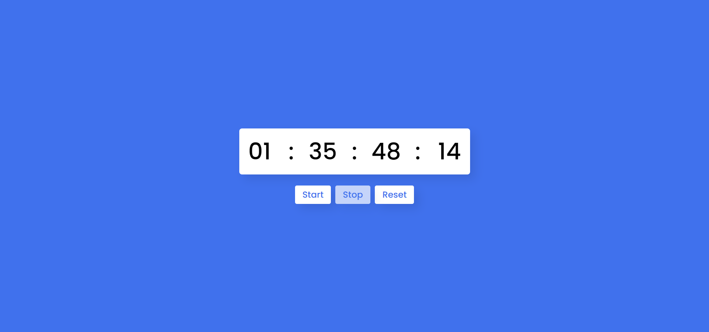

# ⌚ Stopwatch App ⏳

This is a stopwatch app developed using HTML, CSS and Javascript.

## 🔗 Deployed Link

[
Live Link
](https://hourglass-stopwatch.netlify.app/)

## ✨ Features

- Start/Stop/Reset
- Stopwatch UI

## 👨🏻‍💻 Tech Used

  

## 📷 Sreenshot

